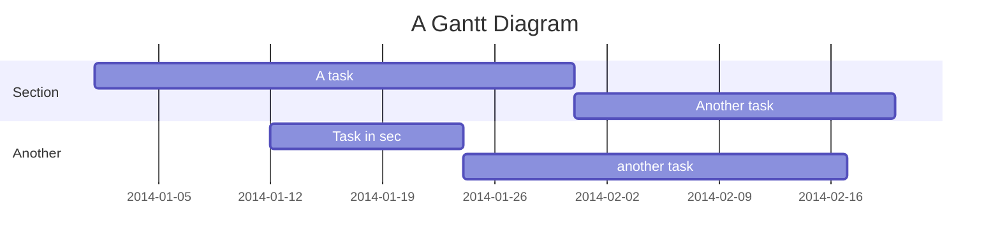
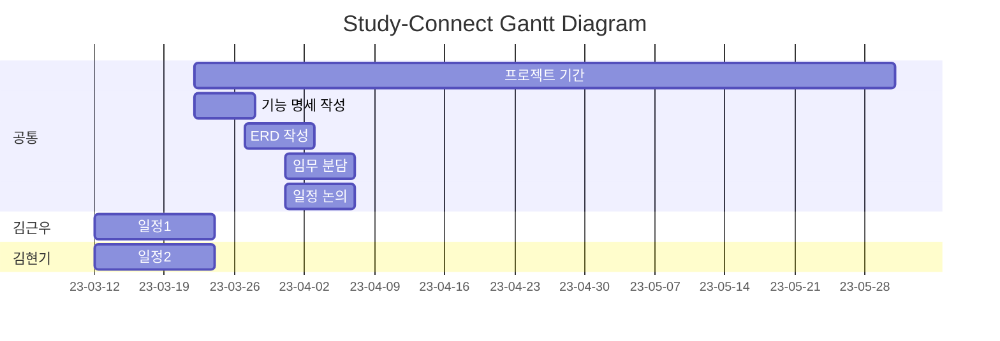

# StudyConnect

```mermaid
gantt
    title A Gantt Diagram
    dateFormat  YYYY-MM-DD
    section Section
    A task           :a1, 2014-01-01, 30d
    Another task     :after a1  , 20d
    section Another
    Task in sec      :2014-01-12  , 12d
    another task      : 24d
```

```mermaid
		gantt
    title Study-Connect Gantt Diagram
    dateFormat  YY-MM-DD
    axisFormat  %y-%m-%d
    section 공통
    프로젝트 기간   :a1, 23-03-22, 23-05-31
    기능 명세 작성  :a2, 23-03-22, 6d
    ERD 작성      :a3, 23-03-27, 7d
		임무 분담      :a4, 23-03-31, 7d
		일정 논의      :a5, 23-03-31, 7d
    section 김근우
    일정1      :23-03-12  , 12d
    section 김현기
    일정2      :2023-03-12  , 12d
```
