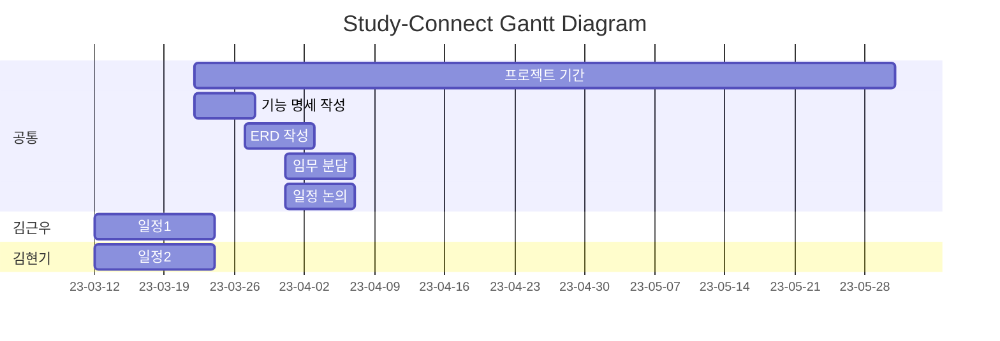

# StudyConnect

>

-----

#### CheckStyle Setting

[초기설정 가이드 링크](https://bestinu.tistory.com/64#article-1-1--intelij-formatter-%EC%A0%81%EC%9A%A9) 
[캠퍼스 핵데이 컨센션 참고 자료](https://naver.github.io/hackday-conventions-java/#_%ED%8C%8C%EC%9D%BC_%EA%B3%B5%ED%86%B5_%EC%9A%94%EA%B1%B4)